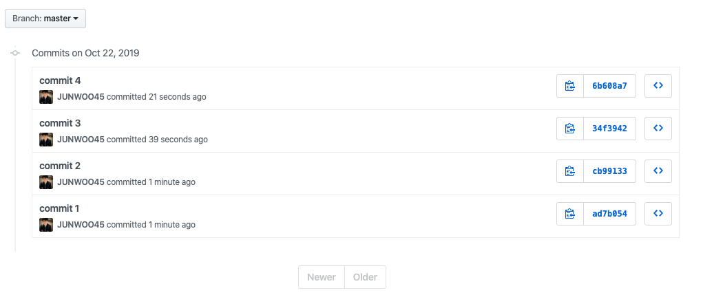
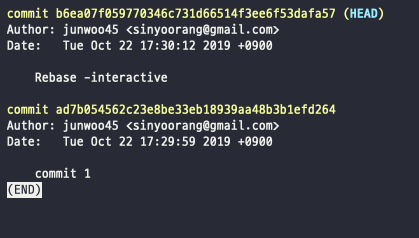
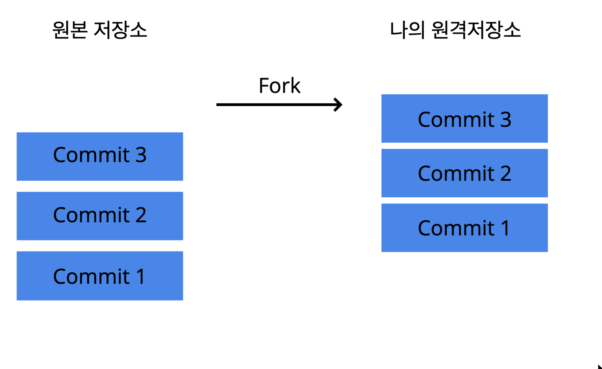
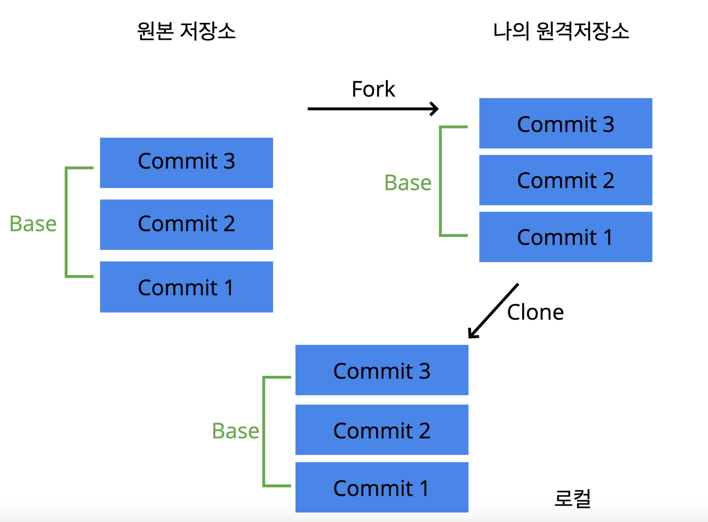
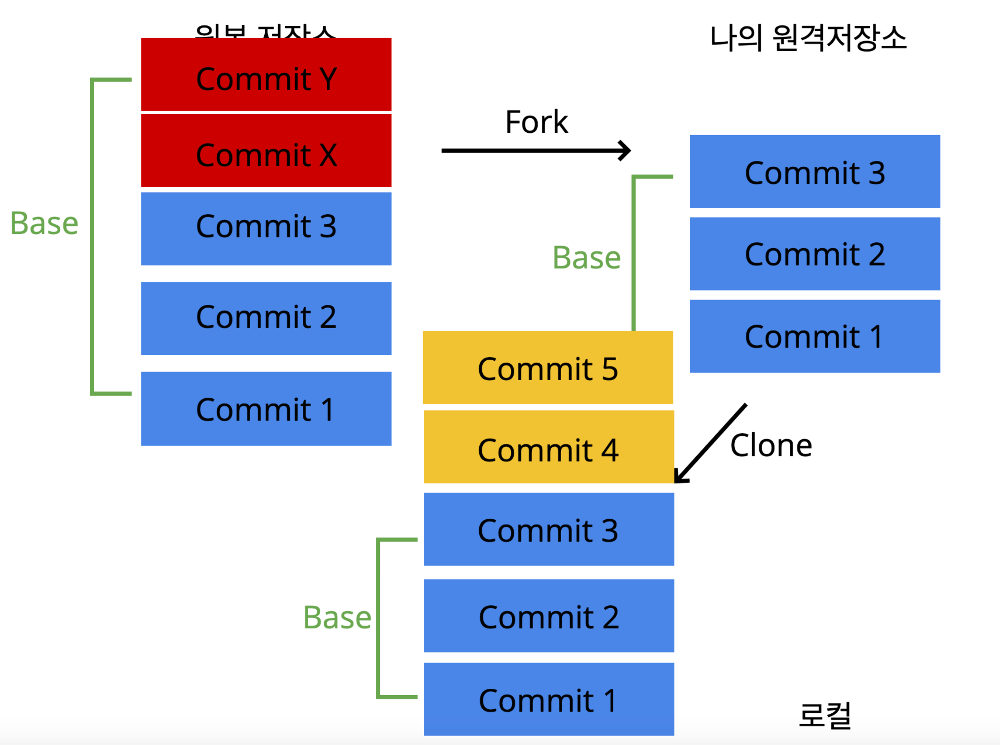
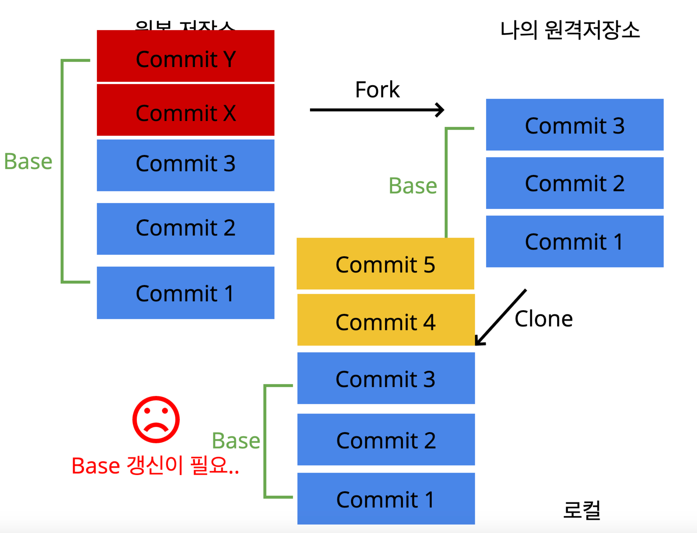
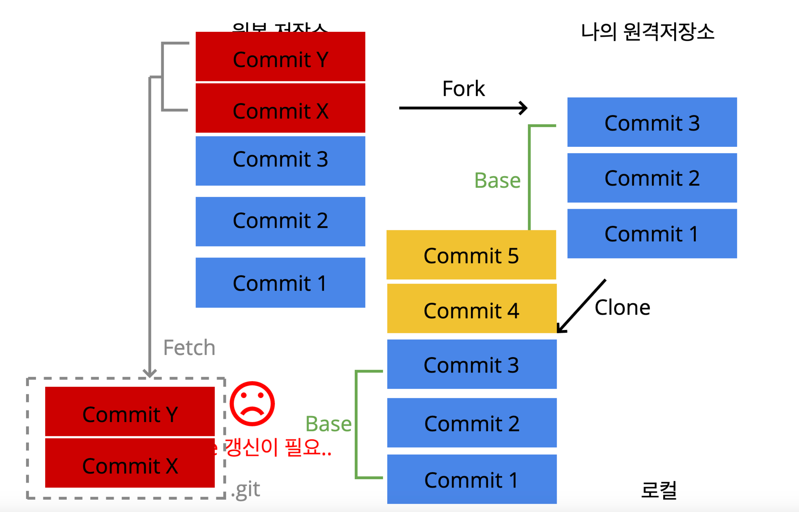
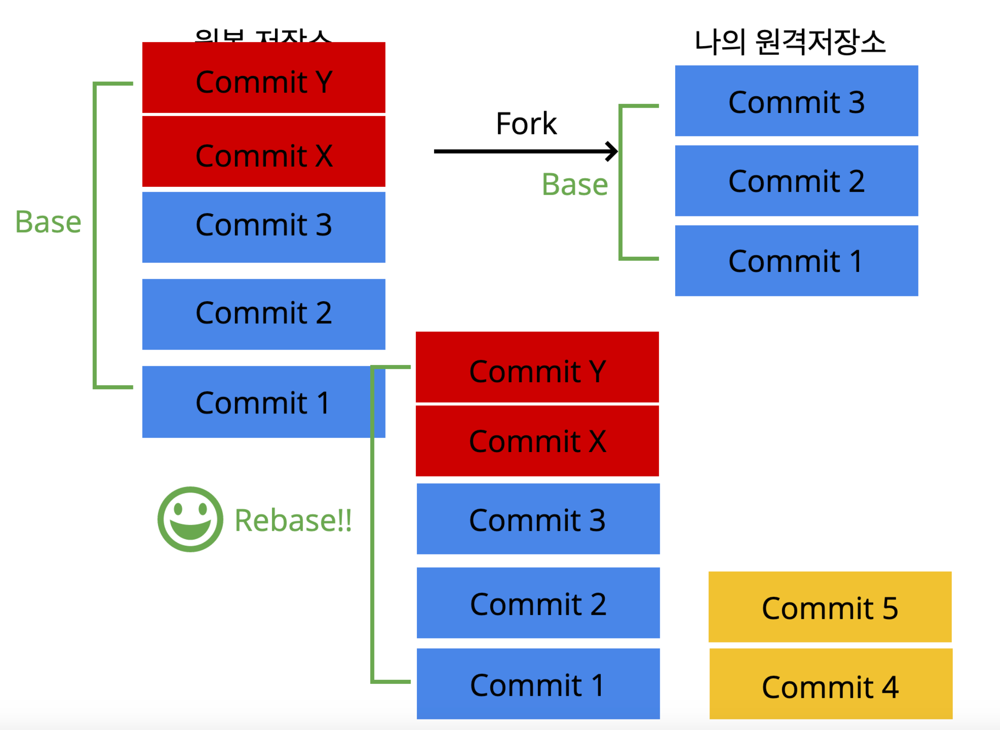

[fork한 저장소를 최신 원본과 동기화 시키기](https://junwoo45.github.io/2019-09-01-git_upstream/) 라는 포스팅을 작성한 적이 있습니다.

간단히 요약하면,

1) `upstream` 에서 받아온 변경사항을 가져오고,

2)  `merge`를 이용해 로컬을 최신화시키고,

3)  `git push` 하여 내 원격저장소를 최신화시키는 방법을 정리한 글입니다.

<br>

이번에 리베이스를 공부하면서, 리베이스가 머지를 이용한 방식보다 더 이러한 상황을 위해 태어난 녀석같다는 생각이 들었습니다.

공부를 게을리해서 다시 `rebase`를 복습해야 하는 상황이 왔을때 정보를 빨리 찾아보고싶으니깐, 바로 사용해보는 예시 먼저 작성하려 합니다.

<br>

---

## rebase를 사용해서 fork한 저장소를 최신 원본과 동기화 시키기

<br>

마찬가지로, 포크한 저장소를 최신 원본과 동기화시키는 상황을 진행할건데요.

사실 `merge` 를 사용한 방법과 다를 것이 없습니다.

<br>

1.우선 현재 저장소의 원격 주소를 확인합니다.

```
$ git remote -v

origin  https://github.com/USERNAME/FORK_REPO.git (fetch)
origin  https://github.com/USERNAME/FORK_REPO.git (push)
```


<br>

2.원본 저장소의 원격 주소를 추가합니다.

```
$ git remote add upstream https://github.com/ORIGINAL_OWNER/ORIGINAL_REPO.git
```


<br>

3.원본 저장소의 원격 주소가 잘 추가되었는지 확인합니다.

```
$ git remote -v

origin  https://github.com/USERNAME/FORK_REPO.git (fetch)
origin  https://github.com/USERNAME/FORK_REPO.git (push)
upstream  https://github.com/ORIGINAL_OWNER/ORIGINAL_REPO.git (fetch)
upstream  https://github.com/ORIGINAL_OWNER/ORIGINAL_REPO.git (push)
```


<br>

4.원본을 fetch합니다.

```
$ git fetch upstream master

remote: Enumerating objects: 253, done.
remote: Counting objects: 100% (253/253), done.
remote: Compressing objects: 100% (4/4), done.
remote: Total 479 (delta 249), reused 252 (delta 249), pack-reused 226
오브젝트를 받는 중: 100% (479/479), 259.99 KiB | 463.00 KiB/s, 완료.
델타를 알아내는 중: 100% (296/296), 로컬 오브젝트 9개 마침.
https://github.com/sarojaba/awesome-devblog URL에서
 * branch            master     -> FETCH_HEAD
 * [새로운 브랜치]   master     -> upstream/master
```


<br>

5.`rebase` 로 base를 교체하기.

```
$ git rebase upstream/master

First, rewinding head to replay your work on top of it...
Fast-forwarded master to upstream/master.
```


<br>

6.나의 원격저장소에 push합니다.

```
$ git push origin master

Total 0 (delta 0), reused 0 (delta 0)
To https://github.com/USERNAME/FORK_REPO.git
   83e93ee..f393fa9  master -> master
```


끝.

<br>

---

## rebase의 작동방식

<br>

`rebase` 에는 interactive라는 옵션이 있는데, 이 옵션이 `rebase` 를 좀 더 자세하게 이해하는데 많은 도움이 되었습니다.

 `rebase` 의 동작방식을 잘게 쪼개놓았다고 이해하면 됩니다.

<br>


commit을 4개 준비했습니다.

저는 `commit 2` 의 커밋메세지가 마음에 들지않아 메세지를 수정하고 싶습니다.



이미 `push` 를 해서 저의 원격저장소에도 올라가있는 상황입니다.

<br>

이러한 상황에서 `git rebase -i` 를 사용하면 쉽게 중간에 낀 커밋메세지를 수정할 수 있습니다.

저는 시간을 되돌리고 싶습니다.

`commit 2` 의 시점으로 되돌아가 메세지를 수정하고 싶은건데요.

<br>

1.`git rebase -i` 명령어를 사용하여 되돌아갈 시점을 선택할 수 있습니다.

```
$ git rebase -i --root
```


<br>

2.자동으로 vi 에디터가 열립니다. 

수정하려는 커밋 앞에 `pick` 대신 `edit` 을 적어주고 저장해줍니다.


<br>

3.에디터가 종료되면 `git log` 명령어를 사용하여 현재 커밋의 상태를 확인해줍니다.

분명 `commit 4` 까지 존재했었지만, 지금은 `commit 2` 가 최신 커밋인 상태입니다.

저는 `commit 2` 가 막 작성된 상태로 시간여행을 온 상태입니다.


<br>

4.커밋메세지를 수정해줍니다.

`git commit --amend` 옵션은 커밋 메세지를 수정할 때 사용됩니다.

```
$ git commit --amend -m "커밋메세지가 이렇게 바뀌면 좋겠다!"
```


<br>

5.`git log` 명령어로 커밋 메세지가 잘 바뀌었는지 확인해봅니다.

```
$ git log
```



잘 바뀌었습니다.

<br>

6.`git rebase --continue` 명령어를 입력해 다시 되돌렸던 시간을 원상복구해줍니다.

```
$ git rebase --continue
```


`git rebase -i` 를 했다면, `git rebase --continue` 도 항상 따라와야합니다.

시간을 돌리고, 다시 풀어주고..

타임스톤은 마구 사용하면 질서를 어지럽히지만, `rebase` 는 `continue`로 다시 돌려주기만 한다면 괜찮습니다.

<br>

7.`git log` 명령어로 현재 상태를 확인해봅니다.

```
$ git log
```


제가 원하던 상태가 되었습니다!

`commit 2` 라고 적혀있던 커밋메세지가 `Rebase -interactive` 라고 잘 바뀌어 있습니다.

<br>

8.이제 저의 원격저장소에 `push` 합니다.

```
$ git push origin master
```


하지만, 실패합니다.

저는 이 문제를 자주 접했는데요.

[git pull 이후 non-fast-forward문제](https://junwoo45til.netlify.com/#/git/git_pull_non-fast-forward) 로 정리했던 저의 troubleshooting페이지도 있습니다. 

사실 이 페이지를 작성할때에는 문제의 원인을 제대로 이해하지못한 상태였습니다.

이 문제에 대한 설명은 포스팅 마지막에 하겠습니다.

<br>

9.강제로 밀어넣기!

```
$ git push origin master -f
```


<center><small>신에게는 아직  `-force`라는 배 한척이 남아있습니다..</small></center>
<br>

10.원격저장소 확인


잘 저장이 되었네요!

<br>

---

## 그런데 말입니다

<br>


<br>

왜 이름이 `rebase` 일까요? ~~그런걸 왜 궁금해해..~~

저는 지금까지 `rebase` 가 헷갈리고, 낯설고, 별로 친해지고 싶지 않았었는데요.

바로 이름때문이었습니다.


'시간을 되돌리는거면 `rewind` 라는 이름이 더 직관적이지 않나? 이름을 왜 이렇게 만든거야?'

`git rewind` .. 누가봐도 시간을 되돌려서 작업을 하는 그런 멋진 명령어입니다.

여담으로, 이름이 헷갈리는 비슷한 녀석이 또 있는데요.

바로 `Pull Request` 입니다.

처음엔 `Pull Request` 라는 이름이 정말 헷갈렸습니다. ~~저만 그런가요..~~

`당김을 요청` ...?

 `가져가주세요` 로 이해하면 되려나..?

PR을 하는 저의 입장이 아닌 메인테이너, upstream의 입장에서의 의미라 너무 와닿지가 않았습니다.

하다못해 `Send a Request` 정도의 단어였다면 ..

어쨌든... `Pull Request` 는 그렇다쳐도 이 `rebase` 라는 이름의 의미를 알고나면 뭐라그럴까..

세상의 이치를 찾아헤매던 마법사가 진실을 마주했을 때의 그것과 비슷한 느낌을 받을 수 있습니다.

<br>

---

## 왜 이름이 rebase일까?

<br>

일반적인 프로젝트의 구조는 다음과 같습니다.



원본 저장소에서 나의 원격 저장소로 `fork` 를 합니다.

<br>



그리고 로컬로 `clone` 을 합니다.

이 때, 원본저장소에서부터 가져온 커밋들을 `base` 라고 부릅니다.

원본 저장소와 포크를 받아온 나의 원격저장소, 그리고 클론을 받은 로컬에는 모두 같은 해시값의 커밋들로 이루어져있습니다.

`base` 가 같은 상황입니다.

git은 억지로 넣어서 `base` 를 교체하지 않는 한, `base` 가 같은 저장소에만 `push` 를 할 수 있습니다.

 <br>

---


로컬에서 작업을 한 상태입니다.

나의 원격저장소로 `push` 를 하고 원본 저장소로 `Pull Request`를 하면.. 

이제 저도 오픈소스 컨트리뷰터가 되는겁니다..~~펄풱..~~

<br>

---



<center>
  <small>
  	하지만 세상 일은 그렇게 호락호락하지 않습니다.
  </small>
</center>

제가 로컬에서 작업을 하고, `push` 를 하고, `Pull Request`를 한 상황이라고 가정하겠습니다.

`Pull Request`를 했지만, 아직 `merge` 가 되지 않은 상황이라고도 가정하겠습니다.

여기서 저의 PR이 머지된다면 이보다도 좋은 상황이 없겠지만..

다른 사람의 작업물이 먼저 리뷰를 받고 원본저장소에 `Merge`가 되어버린 상황입니다.

<br>

---


그때 제가 제출한 PR에 들어가보면 이렇게 `disabled` 상태가 되어있습니다.

 `base` 가 바뀌어버렸기 때문입니다.

`commit1`, `commit2`, `commit3`을 `base`로 한 나의 작업물들은 더이상 `commit1`, `commit2`, `commit3`, `commitX`, `commitY` 를 `base`로 한 저장소와 싱크가 맞지 않는 상태입니다.

<br>

---



이 때가 바로 `base의 갱신이 필요한 상황, 즉 rebase를 해야하는 상황` 입니다.

<br>

---



우선, `fetch` 명령어로 원본저장소의 `diff`를 가져와서 제 로컬에 존재하는 `.git`에 보관해야합니다.

포스팅의 처음에 `git fetch upstream master` 명령어를 실행했던 부분이 이 단계입니다.

<br>

---


그리고 이제 시간을 되돌려야 하는 단계입니다.

`git rebase -i --root` 명령어를 실행했던 부분이 이 단계입니다.

<br>

---



`.git` 에 저장해놨던, `diff` 를 쌓아올려줍니다.

이제 `base` 가 같아졌습니다.

그래서 이름이 `rebase` 였던 것이죠.

<br>

---


그리고 되돌려놨던 저의 커밋들을 그 위에 차곡차곡 쌓아줍니다.

이 부분이 `git rebase --continue` 명령어를 실행했던 단계입니다.

<br>

`base`가 뭔지 알게되니, 왜 이름이 `rebase`인지 납득이 갑니다.

<br>

아까 원격저장소에 `push` 했었던 커밋메세지를 `git rebase -i` 를 이용해서 수정한 뒤, `push` 했을 때 오류가 났었던 걸 기억하시나요?


이 상황이었는데요.

바로 `base`가 바뀌어버렸기 때문에 발생했던 문제였습니다.

`rebase -i` 를 사용해서 과거로 돌아가서, 해당 시점의 커밋메세지를 수정해버리면 커밋의 해시값 또한 바뀌어버립니다.

내 로컬이 들고있는 해시값들과 내 원격저장소가 가지고있는 해시값이 일치하지않아, git은 push를 실패한 것이었습니다.

---

## 마무리

저는 그동안 `rebase` 를 단지 `rewind` 의 개념으로 오해했었는데요.

~~그래서 애꿎은 이름탓을 했었습니다~~

`rewind` 는 `rebase` 의 일부이고, 진정한 `rebase` 는 이름 그대로 `base를 갱신` 하는 것이었습니다.

`rebase` 는 굉장히 유용한 기능입니다.

하지만 그만큼 주의해야할 사항도 있는데요.

[https://git-scm.com/book/ko/v1/Git-%EB%B8%8C%EB%9E%9C%EC%B9%98-Rebase%ED%95%98%EA%B8%B0](https://git-scm.com/book/ko/v1/Git-브랜치-Rebase하기) 에 그림과 함께 굉장히 잘 정리되어있으니 궁금하신 분들은 읽어보시면 좋을 것 같습니다.

읽어주셔서 감사합니다.


