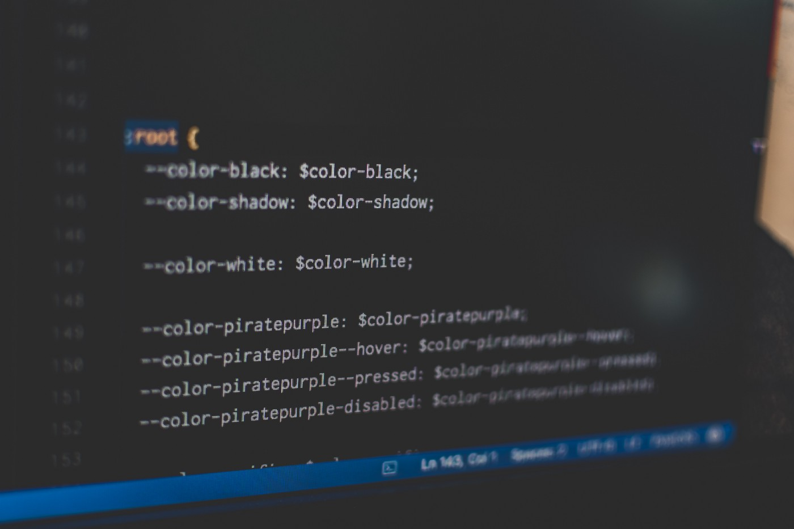
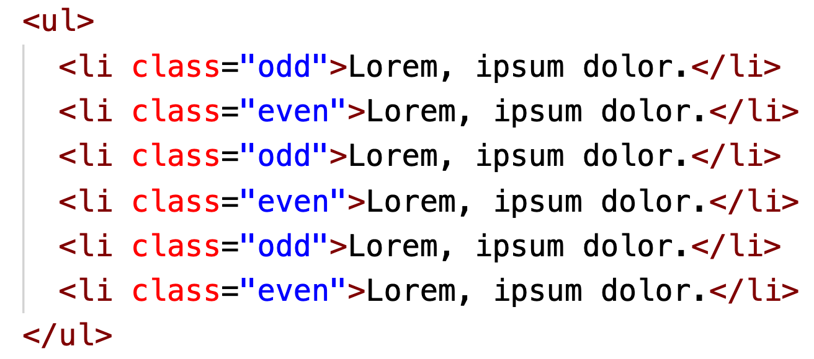
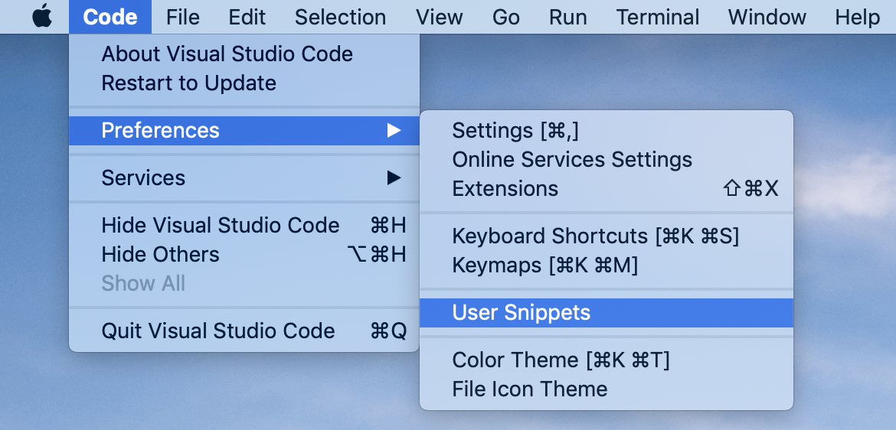
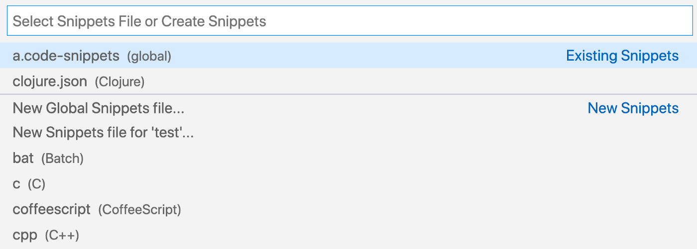
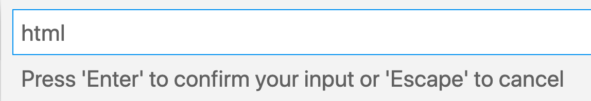
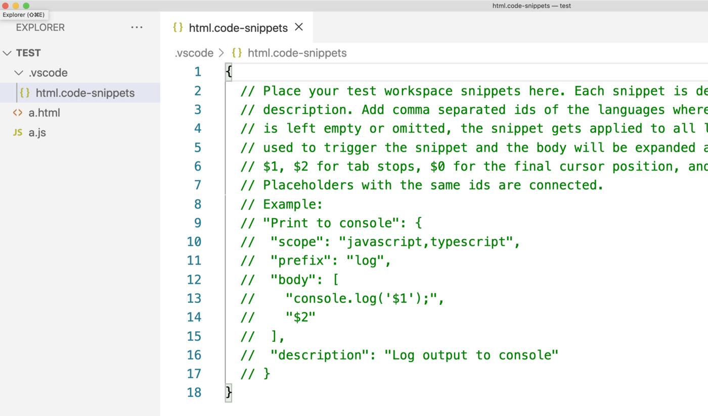
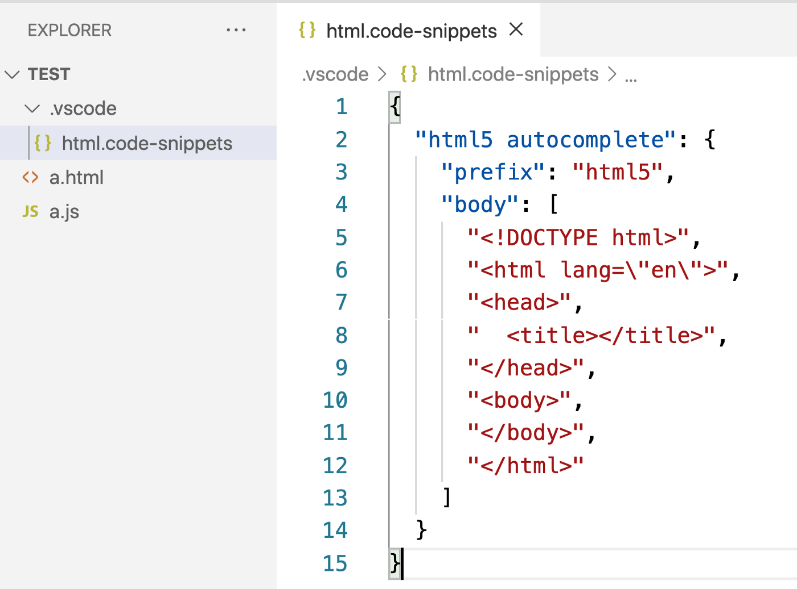
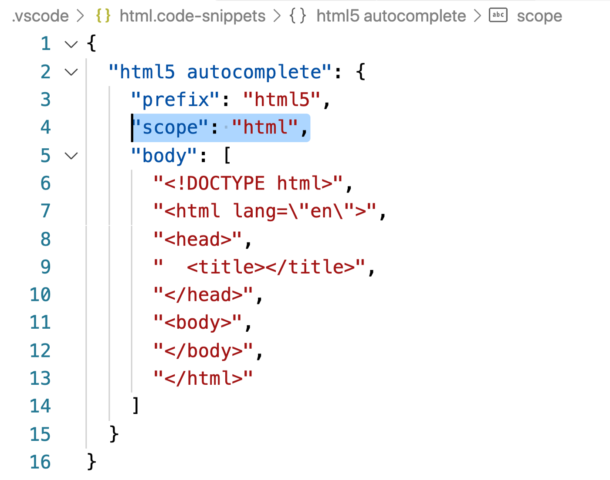
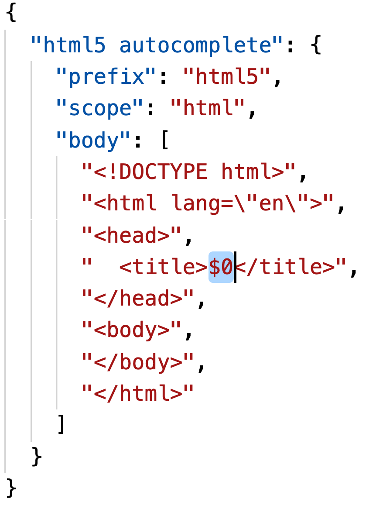

# <번역>시니어 개발자처럼 VSCode 사용하기


>이 글을 bitfish의 Use VSCode Like a Senior Developer을 번역한 글입니다.
>
>원문은 [Use VSCode Like a Senior Developer](https://levelup.gitconnected.com/use-vscode-like-a-senior-developer-9b54054c452a) 에서 확인하실 수 있습니다.




<center><small>Photo by [Pankaj Patel](https://unsplash.com/@pankajpatel?utm_source=medium&utm_medium=referral) on [Unsplash](https://unsplash.com/?utm_source=medium&utm_medium=referral)</small></center>


VSCode는 인기있는 코드 에디터 중 하나이며, VSCode에 익숙해지며 생산성을 엄청나게 끌어올릴 수 있습니다. 이 글에서 소개하는 팁들이 도움이 되었으면 좋겠습니다.

다음과 같은 기능들을 소개할 것입니다.

- 멀티 커서
- Symbol 이름 바꾸기
- 행 이동
- 사용자 정의 스니펫 설정

<br>

## 멀티 커서

가끔 여러 군데에서 동시에 타이핑을 해야 할 수 있습니다.

예를 들면, 첫번째, 세번째, 다섯번째 `<li>` 에 `class="odd"` 속성을 주고, 두번째, 네번째, 여섯번째 `<li>` 에는 `class="even"` 속성을 주려고 합니다.

```html
<ul>
  <li>Lorem, ipsum dolor.</li>
  <li>Lorem, ipsum dolor.</li>
  <li>Lorem, ipsum dolor.</li>
  <li>Lorem, ipsum dolor.</li>
  <li>Lorem, ipsum dolor.</li>
  <li>Lorem, ipsum dolor.</li>
</ul>
```

어떻게 작업하실 생각입니까?



저는 한 곳에 `class="odd"` 를 입력하고, 다른 곳에 복사-붙여넣기를 하곤 했습니다. 하지만 멀티 커서 기능을 알고난 뒤, 제 작업 효율성은 크게 증가했습니다.

특히, 키보드의 Alt 키를 누른 상태에서(macOS의 경우 Option 키), 다른 영역을 클릭하면 추가 커서가 생성됩니다. 이렇게 되면 각 커서 위치에서 동시에 타이핑을 할 수 있습니다.


참고:

- Windows: Alt + Click
- macOS: Option + Click

<br>

## Symbol 이름 바꾸기

쉬운 예를 들어보겠습니다.

코드나 문서를 작성할 때, 철자를 틀리거나 이름 명명 규칙을 바꾸고 싶으면 일괄적으로 단어를 수정해야합니다.

아래와 같은 코드가 있고, `foo` 를 `bar` 로 바꾸고 싶습니다. 어떻게 작업하실 건가요?

```javascript
function foo(){
  // ...
}

foo();
foo();
foo();
```

단어를 하나씩 수정하면, 다음과 같은 단점이 있습니다.

- 너무 귀찮다
- 실수가 발생하기 쉽다

여기서, VSCode의 `Symbol 이름 바꾸기` 를 사용할 수 있다.


<br>

이 옵션은 텍스트를 선택하고 우클릭을 하면 나타납니다. 또는 텍스트를 선택하고 `F2` 단축키를 누르면 됩니다.

<br>

## 행 이동

때때로, 코드나 텍스트를 전체적으로 위/아래로 이동시켜야 할 때가 있습니다.

텍스트를 선택하고 다음과같이 하면 됩니다.

- Windows 경우, 위로 이동 시키려면 `Alt` + `↑` ; 아래로 이동 시키려면 `Alt` + `↓`
- macOS의 경우, 위로 이동 시키려면 `Option` + `↑`; 아래로 이동 시키려면 `Option` + `↓`


<br>

이 기능은 우리가 콘텐츠의 순서를 빠르게 변경하는데 도움을 줍니다.

<br>

## 사용자 정의 스니펫 설정

코드를 작성하다 보면, 몇몇 코드들은 늘 반복해서 사용됩니다.

예를 들어, HTML5 파일은 항상 다음과 같은 기본 구조를 가지게 됩니다.

```html
<!DOCTYPE html>
<html lang="en">
<head>
  <title></title>
</head>
<body>
</body>
</html>
```

그리고 자바스크립트의 for-i 반복문을 작성하다보면, 늘 이러한 형태의 코드를 작성합니다.

```javascript
for(let i = 0; i < ; i++){
  
}
```

이 외에도 굉장히 많은 경우가 있습니다. 이러한 스니펫들이 필요할 때마다 일일히 작성하는 것은 매우 비효율적입니다.

다행히, VSCode는 사용자 정의 자동 완성 기능을 제공합니다. 데모를 보시죠.


위와 같은 기능을 사용하기 위한 VSCode 설정 방법을 알아봅시다.

<br>

### 설정 파일 생성

VSCode는 설정 파일을 읽어야 위와 같은 일을 할 수 있기 때문에, 우선 설정 파일을 만들어야 합니다.

다음과 같은 경로에서 설정 파일을 생성할 수 있습니다.

우선, 설정파일을 생성하기 위해 다음과 같이 이동합니다.

> ### Preferences -> User Snippets



그러면 VSCode에 다음과 같은 창이 뜰 것입니다.



이 창에서, 이미 존재하는 설정파일을 선택한 뒤 수정할 수 있습니다. 또는 새로운 설정 파일을 생성할 수 도 있습니다.

자, 새로운 설정 파일을 만들어보죠.

만약 `New Global Snippets file` 을 선택하면, 전역으로 활성화되는 설정 파일이 만들어집니다.

만약 `New Snippets file for 'test'` 를 선택하면, 해당 프로젝트에서만 활성화되는 설정 파일이 만들어 집니다.

이 프로젝트에서만 활성화되는 파일을 만들어보도록 하죠.

선택을 하고 나면, 새롭게 생성될 파일의 이름을 입력하라고 물어봅니다.



좋습니다. 설정 파일을 만들었습니다.



이 글을 읽는 사람들을 위해 GIF를 녹화했는데, 도움이 되길 바랍니다.


<br>

### 설정

설정 파일은 JSON 형식으로 쓰여집니다.



```
{
 "html5 autocomplete": {
  "prefix": "html5",
  "body": [
   "<!DOCTYPE html>",
      "<html lang=\"en\">",
      "<head>",
      "  <title></title>",
      "</head>",
      "<body>",
      "</body>",
      "</html>"
  ]
 }
}
```

<br>

우선, `"html5 autocomplete"` 필드를 봅시다. 이 필드는 개발자에게 해당 필드가 어떤 역할을 하는지 알려주는 역할을 할 뿐, 다른 일은 하지 않으며 원하는 대로 작성 가능합니다.

`"prefix": "html5"` 를 봅시다. 이 필드는 우리가 정의하는 단축키 명령어입니다. 파일에서 `html5` 라고 입력하면, VSCode는 자동으로 코드를 완성시켜줄 것입니다.

그리고 `"body": [...]` 를 봅시다. 이 필드의 내용은 우리가 완성되길 원하는 코드 본문입니다. 여러 줄의 코드일 수 있기 때문에, 이 필드는 배열 형태로 작성해야 합니다. 배열의 각각의 엘리먼트들은 코드 한 줄을 의미합니다. 위 배열을 코드로 바꿔보면 다음과 같습니다.

```html
<!DOCTYPE html>
<html lang="en">
<head>
  <title></title>
</head>
<body>
</body>
</html>
```

<br>

자, 기본적인 설정을 끝맞췄으니, 테스트해봅시다.


<br>

### 스코프

자, 우리가 설정한 내용들이 잘 동작하는 것은 확인했지만, 조금 더 추가해야 합니다. html5 자동완성 기능은 오직 HTML 파일에서만 사용가능해야하며, 자바스크립트 파일에서는 이 단축 명령어가 필요없습니다.

다행히, 설정 파일에서 스코프를 설정할 수 있습니다.

`"scope": "html"` 필드를 추가해주기만 하면 됩니다.



<br>

다시 테스트해봅시다.


좋습니다. 이제 자바스크립트 파일에서는 단축어는 자동으로 꺼집니다.

<br>

### 커서

자동 완성 기능을 다시 테스트해봅시다. 조금 불편한 점이 있지 않나요?


<br>

자동 완성이 종료되었을 때, 커서는 코드의 끝에 멈춰있는 것을 볼 수 있습니다. 하지만 자동 완성 기능이 더 완전해지기 위해서는 제목이 입력되어야 합니다.

만약 자동 완성 직후, 커서가 `<title></title>` 안에 놓여진다면 더 편하게 작업할 수 있을 겁니다.

특별한 변수인 `$0` 을 추가해서 이 기능을 만들 수 있습니다.



<br>

자동 완성이 된 직후, 커서는 자동적으로 `$0` 에 위치할 것입니다.


<br>

### 예제

이젠 배운 것을 사용해여 새로운 예제를 만들어 봅시다.

자바스크립트나 타입스크립트 파일에서 `fori` 란 문자열을 입력하면 VSCode가 다음과 같은 코드를 자동완성 시키길 원합니다.

```javascript
for(let i = 0; i < ; i++){
}
```

커서는 `i <` 다음에 오면 좋겠네요.

잠시 멈추고, 스스로 방법을 고민해보세요.

좋습니다. 정답을 알려드릴게요.

다음과 같이 코드를 작성할 수 있습니다.

```javascript
{
 "for-i loop": {
    "prefix": "fori",
    "scope": "javascript, typescript",
    "body": [
      "for(let i = 0; i < $0; i++){",
      "}"
    ]
 }
}
```

gif 를 보세요.


<br>

네. 사용자 정의 스니펫을 사용하는 법을 알아봤습니다. 이 기능에 대해 많은 시간을 사용했는데, 왜냐하면 제가 가장 좋아하는 기능이기 때문이며 이 기능이 여러분들에게도 유용할 거라고 생각하기 때문입니다.

예전엔, 중복되는 코드를 입력해야할 때, 다른 파일에서 복사해서 붙여넣는 매우 번거로운 방법을 사용했었습니다. 하지만 우린 이제 더 빠르게 코드를 작성할 수 있게 되었습니다.